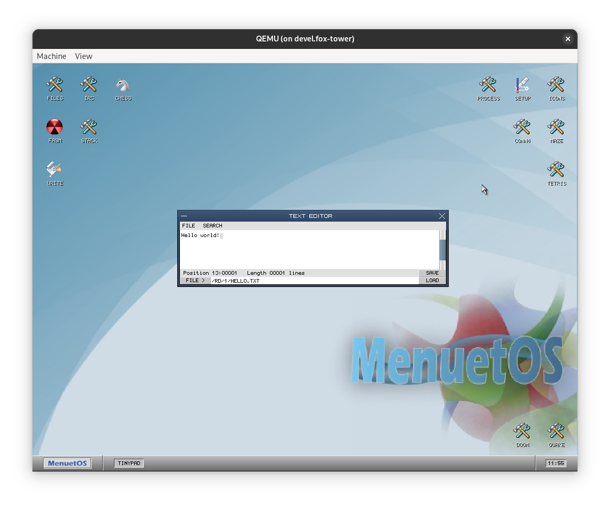

# Menuet32-Plus

**Menuet32-Plus** is a fork of the 32 bit variant of MenuetOS, which aims to fix bugs and add new features while retaining compatibility with
existing MenuetOS applications.

# Screenshot

# Goals

 - [x] Build using a Makefile
 - [x] Fix `/HD` access on startup
 - [x] Minor tweaks to fix building with modern versions of FASM
 - [ ] Modify the ramdisk driver to support accessing files within subdirectories
 - [ ] Format the codebase to fit a consistent style

# Booting in QEMU

If you want to try Menuet32-Plus without writing it to a real floppy disk, you can boot it in QEMU! Note that a hard disk is currently required in order to boot (otherwise it will get stuck at a black screen), so we use the `-hda` argument to create an emulated hard disk using the `build` directory. Feel free to change `fat:rw:build/` to point to your own disk image or mountpoint.

`qemu-system-i386 -fda m32-plus.img -hda fat:rw:build/ -boot order=a`
